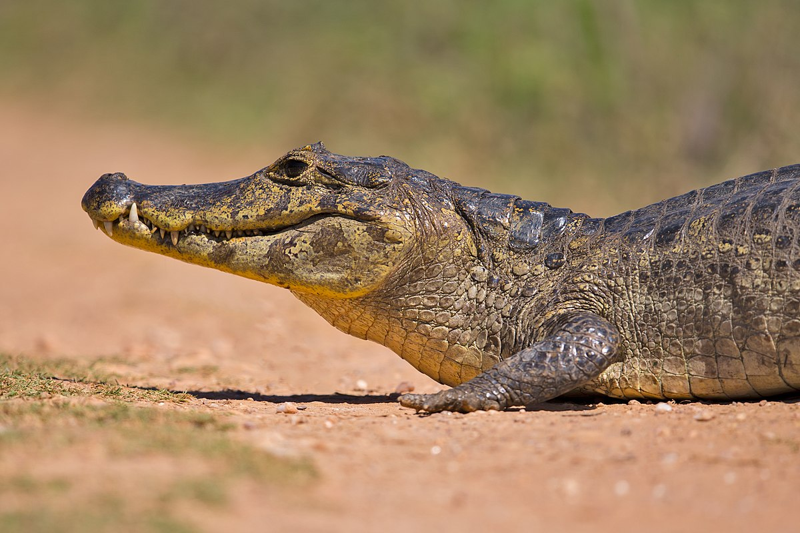

# yacare

A companion to [CaImAn](https://github.com/flatironinstitute/CaImAn) for calcium imaging analysis. There are some questions that come up frequently in [caiman's gitter forum](https://gitter.im/agiovann/Constrained_NMF), and many useful tools embedded in caiman that are not illustrated in the demos. The goal of yacare is to tackle these topics in standalone Jupyter notebooks. It mainly assumes you have a working caiman virtual environment.

Yacare is named after the South American [yacare caiman](https://en.wikipedia.org/wiki/Yacare_caiman), pictured above.

If you want to contribute, or want to see a topic covered, please open an issue. For caiman support, see the [gitter forum](https://gitter.im/agiovann/Constrained_NMF).

## Notebooks
- [normalize_1p_traces.ipynb](normalize_1p_traces.ipynb)    
- [visualize_ridge_plot.ipynb](visualize_ridge_plot.ipynb)

## To do
- Multisession registration
- Seed plot for cnmfe

## Acknowledgments
- Developed with support from NIH Bioinformatics and the Neurobehavioral Core at NIEHS.
- The caiman developers and community for providing such useful tools.
- Yacare caiman image is from [Wikimedia](https://commons.wikimedia.org/wiki/File:Brillenkaiman_Caiman_yacare.jpg).
